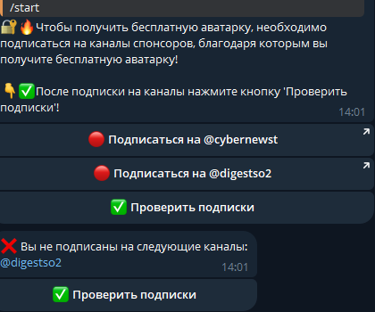
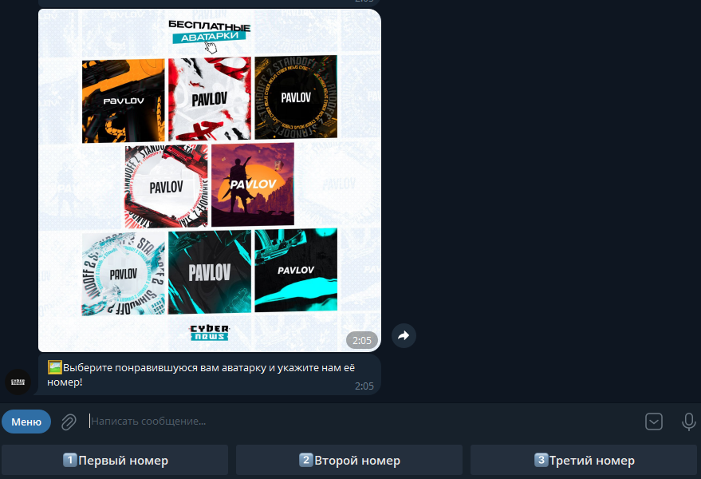
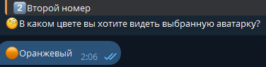
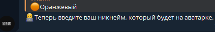
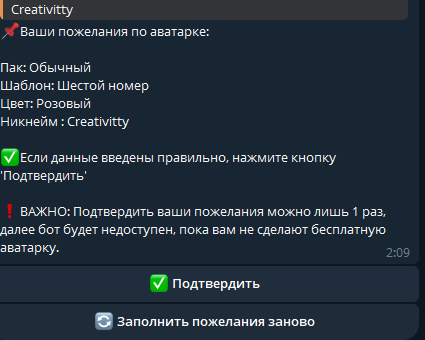
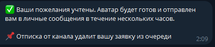
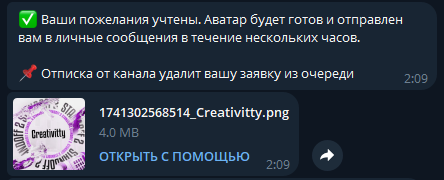
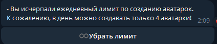
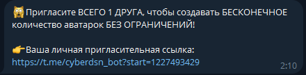

# Telegram Bot — Уникальные Аватарки за Подписку  

## 📌 Описание проекта  

**Telegram-бот** для генерации **уникальных аватарок** на основе предпочтений пользователя.  
Для получения аватарки пользователь должен подписаться на указанный Telegram-канал.  

📌 **Ботом воспользовались уже более 50 000 человек!**  

## 🚀 Функционал  

✔ **Подписка на канал** — обязательное условие для использования бота.  
✔ **Выбор стиля** аватарки из предустановленных шаблонов.  
✔ **Настройка цветовой гаммы** для персонализации аватарки.  
✔ **Ввод никнейма**, который будет добавлен на изображение.  
✔ **Подтверждение выбора** перед окончательной генерацией.  
✔ **Получение аватарки** в высоком качестве прямо в чате с ботом.  
✔ **Лимиты**: Одна аватарка каждые 24 часа.  
✔ **Реферальная система**: Снятие лимита за приглашение друга.  

## 🖼 Скриншоты 

1. **Обязательная подписка**
    
   

2. **Выбор аватарки**
    
   

3. **Выбор цвета**
    
   

4. **Выбор никнейма**
    
   
   
5. **Подтверждение введенных данных**
    
   

6. **Уведомление после подтверждения**
    
   

7. **Готовая аватарка по заданным критериям отправляется файлом**
    
   

8. **Ограничения на 4 аватарки в день**
    
   
   
9. **Реферальная система**
    
   

## 🛠 Технологии  

- **Python** — основной язык разработки  
- **aiogram** — асинхронная работа с Telegram API  
- **PostgreSQL** — база данных  
- **SQLAlchemy** — ORM для взаимодействия с БД  
- **Pillow** — обработка изображений  
- **asyncio** — асинхронная работа  

